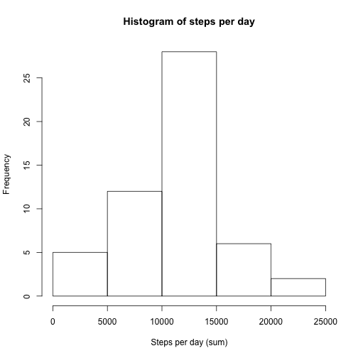
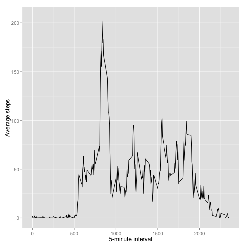
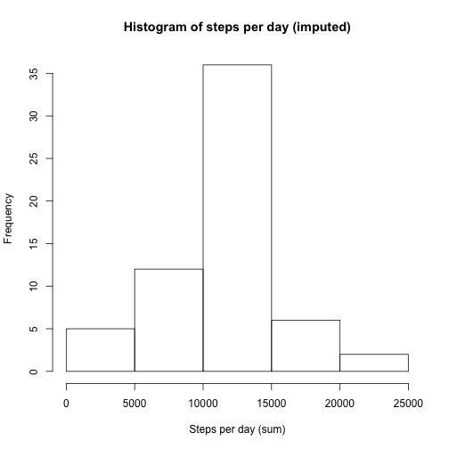
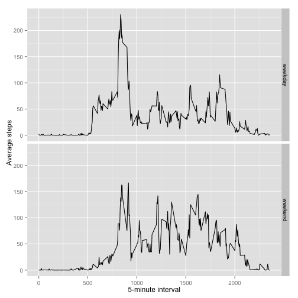

# Reproducible Research: Peer Assessment 1

The following is an assignment in the course *Reproducible Research* held by Johns Hopkins university and Coursera. For further information, see the file **README.md** in this repository.
***
## Preparation

For this assignment, two external packages were attached, `dplyr` and `ggplot2`. If needed, run `install.packages()` before sourcing the following script.

```r
suppressMessages(library(dplyr))
suppressMessages(library(ggplot2))
```

The csv file was extracted from zip (if it not already exists).

```r
if(!file.exists("activity.csv")) {
        unzip("activity.zip")
}
```
***
## Loading and preprocessing the data

1. The csv file was read into memory.

```r
activity <- tbl_df(read.csv("activity.csv"))
str(activity)
```

```
## Classes 'tbl_df', 'tbl' and 'data.frame':	17568 obs. of  3 variables:
##  $ steps   : int  NA NA NA NA NA NA NA NA NA NA ...
##  $ date    : Factor w/ 61 levels "2012-10-01","2012-10-02",..: 1 1 1 1 1 1 1 1 1 1 ...
##  $ interval: int  0 5 10 15 20 25 30 35 40 45 ...
```

2. Then, `activity$date` was changed from factor to POSIXct

```r
activity$date <- as.POSIXct(activity$date)
str(activity)
```

```
## Classes 'tbl_df', 'tbl' and 'data.frame':	17568 obs. of  3 variables:
##  $ steps   : int  NA NA NA NA NA NA NA NA NA NA ...
##  $ date    : POSIXct, format: "2012-10-01" "2012-10-01" ...
##  $ interval: int  0 5 10 15 20 25 30 35 40 45 ...
```
***
## What is mean total number of steps taken per day?

To calculate the number of steps per day, the data was grouped per day and summarised.

```r
perDay <- group_by(activity, date)
sumStepsDay <- summarise(perDay, StepsPerDay = sum(steps))
```

1. Histogram of total number of steps per day.

```r
hist(sumStepsDay$StepsPerDay, main = "Histogram of steps per day",
     xlab = "Steps per day (sum)")
```

 

2. Calculation of mean and median total number of steps per day.

```r
mean(sumStepsDay$StepsPerDay, na.rm = T)
```

```
## [1] 10766.19
```

```r
median(sumStepsDay$StepsPerDay, na.rm = T)
```

```
## [1] 10765
```

Thus, the *mean* total number of steps per day was **10766**, and the *median* number was **10765**.
***
## What is the average daily activity pattern?

To calculate the average daily activity pattern, the data was grouped per 5-minute interval, and the mean number of steps per interval was obtained.


```r
perInterval <- group_by(activity, interval)
averageStepsInterval <- summarise(perInterval, AvgSteps = mean(steps, na.rm = T))
```

1. Time series plot of the 5-minute interval and the average number of steps taken, averaged across all days.


```r
print(ggplot(averageStepsInterval, aes(x = interval, y = AvgSteps))
      + geom_line() + xlab("5-minute interval") + ylab("Average steps"))
```

 

2. Which 5-minute interval contains the maximum number of steps?


```r
maxStepsInterval <- top_n(averageStepsInterval, 1, AvgSteps)
maxStepsInterval
```

```
## Source: local data frame [1 x 2]
## 
##   interval AvgSteps
##      (int)    (dbl)
## 1      835 206.1698
```

Thus the 5-minute interval with the maximum number of steps was **835** (and the number of steps in that interval was roughly **206**).
***
## Imputing missing values

1. Total number of missing values in the dataset (i.e. the total number of rows with NAs).


```r
table(is.na(activity))
```

```
## 
## FALSE  TRUE 
## 50400  2304
```

```r
summary(activity)
```

```
##      steps             date                        interval     
##  Min.   :  0.00   Min.   :2012-10-01 00:00:00   Min.   :   0.0  
##  1st Qu.:  0.00   1st Qu.:2012-10-16 00:00:00   1st Qu.: 588.8  
##  Median :  0.00   Median :2012-10-31 00:00:00   Median :1177.5  
##  Mean   : 37.38   Mean   :2012-10-30 23:32:27   Mean   :1177.5  
##  3rd Qu.: 12.00   3rd Qu.:2012-11-15 00:00:00   3rd Qu.:1766.2  
##  Max.   :806.00   Max.   :2012-11-30 00:00:00   Max.   :2355.0  
##  NA's   :2304
```
Thus, there are in total **2304** rows with NAs in the dataset, and all NAs are in the column `activity$steps.

2. To fill in all of the missing values in the dataset, a simple strategy was implemented, in which entries with NAs were replaced by the mean number of steps for that 5-minute interval.
3. A new dataset `activityImputed` was created according to this strategy.


```r
activityImputed <- activity
for(i in 1:nrow(activityImputed)) {
        if(is.na(activityImputed[i, 1])){
                imputedValue <- filter(averageStepsInterval,
                                       interval == as.numeric(activityImputed[i, 3]))
                activityImputed[i, 1] <- imputedValue[1, 2]
        }
}
```


```r
head(activity)
```

```
## Source: local data frame [6 x 3]
## 
##   steps       date interval
##   (int)     (time)    (int)
## 1    NA 2012-10-01        0
## 2    NA 2012-10-01        5
## 3    NA 2012-10-01       10
## 4    NA 2012-10-01       15
## 5    NA 2012-10-01       20
## 6    NA 2012-10-01       25
```

```r
head(activityImputed)
```

```
## Source: local data frame [6 x 3]
## 
##       steps       date interval
##       (dbl)     (time)    (int)
## 1 1.7169811 2012-10-01        0
## 2 0.3396226 2012-10-01        5
## 3 0.1320755 2012-10-01       10
## 4 0.1509434 2012-10-01       15
## 5 0.0754717 2012-10-01       20
## 6 2.0943396 2012-10-01       25
```

4. Grouped per day, summarised, and created histogram of total number of steps per day (with imputed values).


```r
perDayImp <- group_by(activityImputed, date)
sumStepsDayImp <- summarise(perDayImp, StepsPerDay = sum(steps))
hist(sumStepsDayImp$StepsPerDay, main = "Histogram of steps per day (imputed)",
     xlab = "Steps per day (sum)")
```

 

5. Calculation of mean and median total number of steps per day (with imputed values).


```r
mean(sumStepsDayImp$StepsPerDay)
```

```
## [1] 10766.19
```

```r
median(sumStepsDayImp$StepsPerDay)
```

```
## [1] 10766.19
```

Thus, the *mean* total number of steps per day was **10766**, and the *median* number was **10766**. Compared to the estimates from the first part of the assignment, the median is now closer to the mean (identical), and the histogram displays a stronger central tendency (less dispersed).
***
## Are there differences in activity patterns between weekdays and weekends?

1. Created a new factor variable in the dataset with two levels – “weekday” and “weekend”. *NOTE to persons grading this assignment - I did this work on a Swedish system, hence the use of "Lördag" (Saturday) and "Söndag" (Sunday) in the following code.*


```r
activityImputed <- mutate(activityImputed, weekDay = weekdays(date))
for(i in 1:nrow(activityImputed)) {
        if(activityImputed[i, 4] %in% c("Lördag", "Söndag")) {
                activityImputed[i, 5] <- "weekend"
        }
        else {
                activityImputed[i, 5] <- "weekday"
        }
}
```

2. Panel plot containing a time series plot of the 5-minute interval (x-axis) and the average number of steps taken, averaged across all weekday days or weekend days.


```r
perWeekendIntervalImp <- group_by(activityImputed, V5, interval)
avgStepsWeekendIntImp <- summarize(perWeekendIntervalImp, AvgStepsWeek = mean(steps))
print(ggplot(avgStepsWeekendIntImp, aes(x = interval, y = AvgStepsWeek))
      + geom_line() + facet_grid(V5 ~ .) + xlab("5-minute interval") + ylab("Average steps"))
```

 

As evident from the graph, in the weekdays there is a higher peak of activity in the early day, whereas the activity is more even throughout the day in the weekends.
